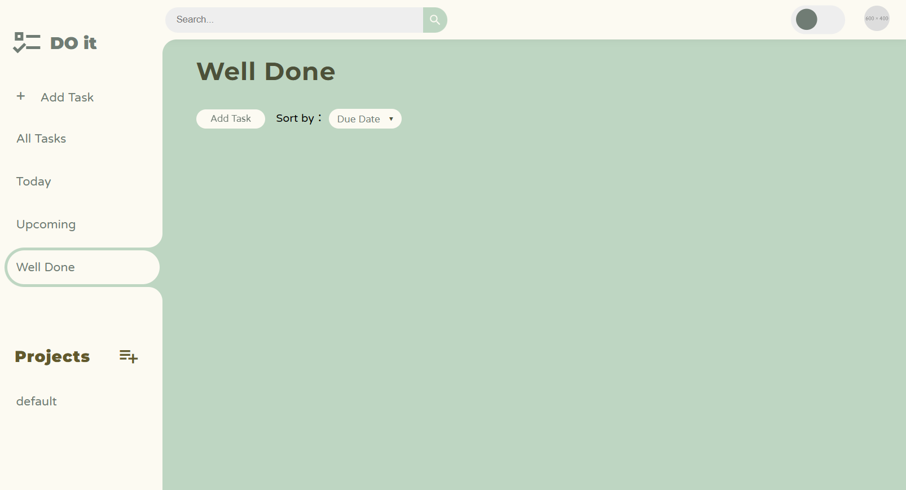
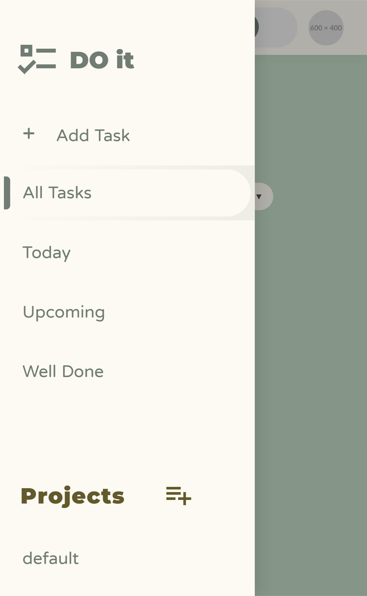
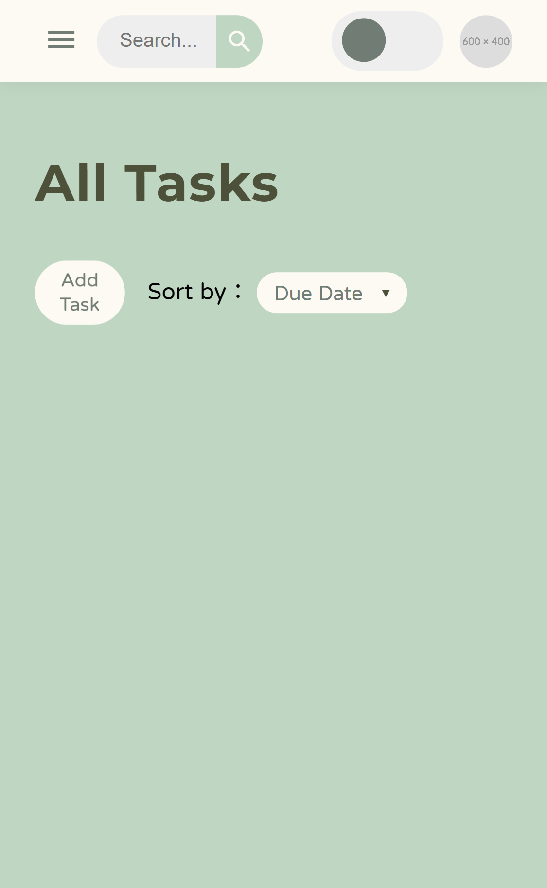

## Todo-List 應用程式
採用原生 JavaScript 開發，具備完整的響應式佈局，在桌機與手機上都能優雅地管理任務。

<br />
<br />

### 🔗 線上預覽

<div>
  
  
</div>


👉 [點此查看作品](https://gagaa03.github.io/Todo-list/)


<br />
<br />
<br />
<br />

## ✨ 核心特色

### 🌓 視覺體驗
* **深淺模式切換**：支援手動切換與偏好記憶，提供舒適的閱讀環境。
* **UI 細節**：
    * **反向圓角 (Inverted Border Radius)**：側邊欄選單採用流暢的負空間圓角設計。
    * **CSS Grid 佈局**：任務卡片自動適應螢幕寬度，保持視覺整齊。

<br />

### 📱 行動端優化 (RWD)
* **抽屜式側邊欄**：在手機端自動收納，點擊觸發流暢的滑入動畫與背景遮罩。
* **動態搜尋體驗**：點擊搜尋框時，延伸輸入空間並隱藏次要元件，換取最佳輸入視野。

<br />

### ⚙️ 功能管理
* **項目分類**：支援多項目並行管理，清晰區分不同生活範疇的任務。
* **排序與過濾**：可依據**關鍵字、日期或優先級**即時篩選任務。
* **數據持久化**：整合 `LocalStorage` 技術，確保重新整理或關閉瀏覽器後資料不遺失。

---

### 🛠️ 技術棧 (Tech Stack)

<br />

* **Logic:** Vanilla JavaScript (ES6+ / 模組化開發)
* **Styling:** CSS3 (Flexbox, Grid, Custom Properties)
* **Icons:** Material Design Icons (MDI), Boxicons
* **Bundler:** Webpack 5 (配置處理 CSS-loader, HtmlWebpackPlugin)
* **Deployment:** GitHub Pages (搭配 gh-pages 自動化部署)

---

快速上手

```bash
1. 複製專案
git clone [https://github.com/gagaa03/Todo-list.git](https://github.com/gagaa03/Todo-list.git)

2. 安裝依賴
npm install

3. 開發環境啟動
npm run start
